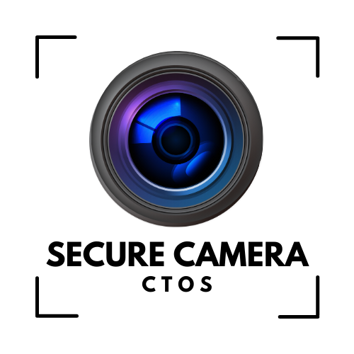

# 🛡️ Secure Camera - ctOS

[](https://developer.android.com)
[](https://kotlinlang.org)
[](https://developer.android.com/camerax)
[](LICENSE)

Professional surveillance camera application with **real-time GPS tracking**, **HD video recording**, **anti-piracy protection** and **Watch Dogs-inspired UI**. Built with modern Android architecture and enterprise-grade security features.



## ✨ Features

### 📸 **Camera & Video**
- **High-Definition Photo Capture** with CameraX integration
- **HD Video Recording** with audio support
- **Real-time Preview** with professional overlay
- **Orientation Detection** (Portrait/Landscape adaptive UI)
- **Custom Camera Controls** with Watch Dogs-style interface

### 🛰️ **Advanced GPS Tracking**
- **Real-time Location Updates** every 5 seconds
- **Multiple GPS Strategies** (LastLocation + Live updates)
- **High Accuracy Mode** with fallback providers
- **GPS Status Indicators** with precision metrics
- **Location Embedding** in photos and videos

### 📤 **Automatic Transmission**
- **Email Integration** with automatic photo/video sending
- **Web Server Upload** support for enterprise environments
- **Configurable Recipients** and server endpoints
- **GPS Metadata** included in all transmissions
- **Secure File Sharing** via FileProvider

### 🛡️ **Security & Anti-Piracy**
- **Code Obfuscation** with ProGuard
- **Signature Verification** to prevent tampering
- **Installation Source Validation**
- **Runtime Security Checks**
- **Debug Protection** mechanisms

### 🎨 **Professional UI**
- **ctOS-Inspired Design** with green terminal aesthetics
- **Real-time Overlays** showing GPS, timestamp, and status
- **Responsive Layouts** for all screen orientations
- **Professional Typography** with monospace fonts
- **Security Camera Interface** elements

## 📱 Requirements

- **Android 7.0** (API level 24) or higher
- **Camera Permission** for photo/video capture
- **Location Permission** for GPS tracking
- **Storage Permission** for file saving
- **Internet Permission** for email/server features
- **Microphone Permission** for video audio recording

## 🚀 Installation

### Option 1: Download APK
1. Go to [Releases](../../releases)
2. Download the latest `app-debug.apk`
3. Enable "Install from Unknown Sources" in Android settings
4. Install the APK

### Option 2: Build from Source
```bash
git clone https://github.com/adaymathers/Secure-Camera---ctOS.git
cd Secure-Camera---ctOS
./gradlew assembleDebug
```

## 🛠️ Development Setup

### Prerequisites
- **Android Studio** Arctic Fox or newer
- **Android SDK** API 24-33
- **Kotlin** 1.9.0+
- **Gradle** 8.0+

### Building
```bash
# Clone the repository
git clone https://github.com/adaymathers/Secure-Camera---ctOS.git

# Open in Android Studio or build via command line
cd Secure-Camera---ctOS
./gradlew assembleDebug

# APK location: app/build/outputs/apk/debug/app-debug.apk
```

## ⚙️ Configuration

### Email Setup
1. Open app → ⚙️ Settings
2. Enter email address for automatic sending
3. Configure SMTP settings (optional)

### Web Server Upload
1. Settings → Enable "Web Server Mode"
2. Enter server endpoint URL
3. Configure authentication if required

### GPS Settings
- App automatically uses high-accuracy GPS
- Ensure location services are enabled
- Grant "Allow all the time" permission for best results

## 📁 Project Structure

```
app/
├── src/main/java/com/ctos/camerahc2/
│   ├── MainActivity.kt              # Main camera interface
│   ├── ConfigActivity.kt            # Settings configuration
│   └── security/                    # Anti-piracy protection
├── src/main/res/
│   ├── layout/                      # UI layouts (portrait/landscape)
│   ├── drawable/                    # Icons and graphics
│   └── values/                      # Strings and themes
└── build.gradle                     # Dependencies and build config
```

## 🔧 Technologies Used

- **[CameraX](https://developer.android.com/camerax)** - Modern camera API
- **[FusedLocationProvider](https://developers.google.com/location-context/fused-location-provider)** - Advanced GPS tracking
- **[ViewBinding](https://developer.android.com/topic/libraries/view-binding)** - Type-safe view references
- **[Material Components](https://material.io/develop/android)** - UI components
- **[OkHttp](https://square.github.io/okhttp/)** - HTTP client for server uploads
- **[ProGuard](https://www.guardsquare.com/proguard)** - Code obfuscation

## 🛡️ Security Features

This app implements multiple security layers:

- **Code Obfuscation**: All code is obfuscated to prevent reverse engineering
- **Signature Verification**: Validates app signature to detect tampering
- **Source Validation**: Ensures installation from trusted sources
- **Runtime Checks**: Continuous security monitoring during execution
- **Debug Protection**: Prevents debugging and analysis tools

## 📝 License

This project is licensed under the MIT License - see the [LICENSE](LICENSE) file for details.

## 🤝 Contributing

1. Fork the project
2. Create a feature branch (`git checkout -b feature/AmazingFeature`)
3. Commit your changes (`git commit -m 'Add some AmazingFeature'`)
4. Push to the branch (`git push origin feature/AmazingFeature`)
5. Open a Pull Request

## 📞 Support

- **Issues**: [GitHub Issues](../../issues)
- **Documentation**: [Wiki](../../wiki)
- **Security**: Report security issues privately

## 🎯 Roadmap

- [ ] **Cloud Backup** integration
- [ ] **Multi-camera** support
- [ ] **Motion Detection** alerts
- [ ] **Live Streaming** capabilities
- [ ] **Facial Recognition** (optional)
- [ ] **Dark Mode** theme

---

**⚡ Built with passion for security and surveillance technology**